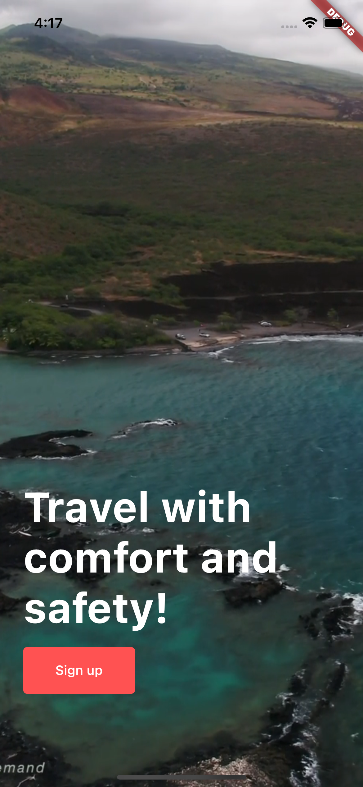
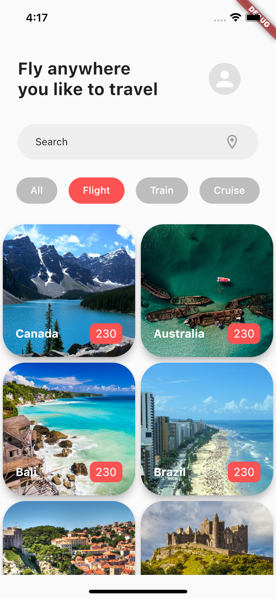

# flutter-travelapp
speed coding.
all asset files are included in the `/aseets` folder.

&nbsp;&nbsp;&nbsp;&nbsp;&nbsp;&nbsp;&nbsp;&nbsp;

# dependencies used
https://github.com/flutter/plugins/tree/master/packages/video_player/video_player
